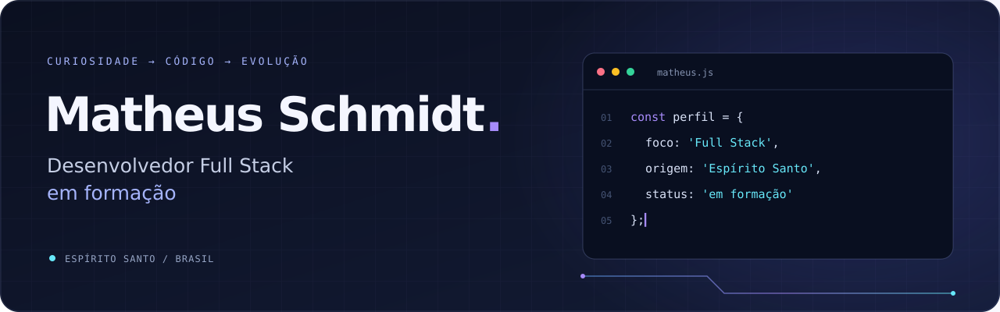
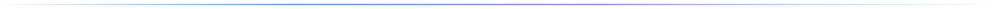

  

  

  
  
  

  <a href="#sobre-mim">Sobre mim</a> &nbsp;·&nbsp;
  <a href="#tecnologias">Tecnologias</a> &nbsp;·&nbsp;
  <a href="#minha-direção">Minha direção</a>

## Sobre mim

Olá! Sou o **Matheus**, tenho 18 anos e sou do **Espírito Santo**. Estou concluindo o Ensino Médio e o curso técnico em **Análise e Desenvolvimento de Sistemas pelo SENAI**.

Minha curiosidade por tecnologia começou cedo: sempre quis entender como as coisas funcionam. Hoje, estou transformando essa curiosidade em prática e construindo meu caminho no desenvolvimento **Full Stack**.

Gosto de desafios que me fazem aprender. Quero criar aplicações úteis, melhorar a cada projeto e transformar minha paixão por tecnologia em carreira.

## Tecnologias

Estas são as tecnologias que fazem parte dos meus estudos e projetos:

  

  HTML · CSS · JavaScript · React · Node.js · Bootstrap · Git

## Minha direção

| Quero construir | Quero desenvolver |
| :--- | :--- |
| Interfaces claras e responsivas | Minha base em HTML, CSS, JavaScript e React |
| Aplicações que conectem interface e servidor | Minha visão do desenvolvimento Full Stack |
| Projetos que resolvam problemas reais | Minha prática, organização e autonomia |

<!-- PROJETOS: preencha com projetos reais e remova este comentário.

## Projetos em destaque

| Projeto | O que ele resolve | Tecnologias | Links |
| :--- | :--- | :--- | :--- |
| NOME_DO_PROJETO_1 | Descreva o problema e sua solução em uma frase. | TECNOLOGIAS_DO_PROJETO | [Código](https://github.com/SEU_USUARIO/SEU_REPOSITORIO_1) · [Demo](https://SUA_DEMO_1) |
| NOME_DO_PROJETO_2 | Descreva o problema e sua solução em uma frase. | TECNOLOGIAS_DO_PROJETO | [Código](https://github.com/SEU_USUARIO/SEU_REPOSITORIO_2) · [Demo](https://SUA_DEMO_2) |

-->

<!-- ESTATISTICAS: execute o workflow antes de remover este comentário.

## Minha jornada em código

  
  

  <picture>
    <source media="(prefers-color-scheme: dark)" srcset="./assets/generated/snake-dark.svg" />
    <source media="(prefers-color-scheme: light)" srcset="./assets/generated/snake.svg" />
    
  </picture>

-->

<!-- CONTATO: substitua os endereços pelos seus e remova este comentário.

## Vamos conversar?

  
  

-->

  <strong>Curiosidade para começar. Dedicação para continuar.</strong>

