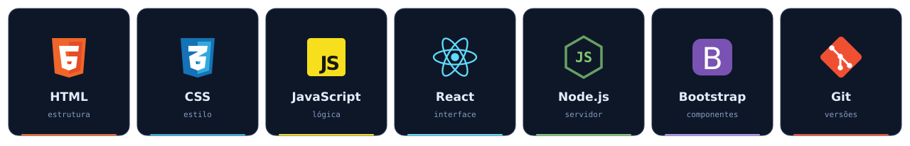

  

  

## 👋 Sobre mim

Sou o **Matheus Schmidt**, tenho **18 anos** e sou do **Espírito Santo**. Estou concluindo o Ensino Médio e o curso técnico em **Análise e Desenvolvimento de Sistemas pelo SENAI**.

Sempre gostei de entender o que acontece por trás das telas. Hoje, estou transformando essa curiosidade em código e construindo meu caminho no desenvolvimento **Full Stack**.

Gosto de desafios que me fazem aprender. Quero criar aplicações úteis, evoluir a cada projeto e transformar minha paixão por tecnologia em carreira.

## ⚡ Meu kit de estudos

  <picture>
    <source media="(max-width: 600px)" srcset="./assets/stack-mobile.svg" />
    
  </picture>

  <strong>HTML · CSS · JavaScript · React · Node.js · Bootstrap · Git</strong>

## 🧭 O que quero construir

| 🖥️ Interfaces | ⚙️ Aplicações | 🚀 Minha evolução |
| :--- | :--- | :--- |
| Páginas claras, responsivas e agradáveis de usar. | Soluções que conectem a interface à lógica do servidor. | Aprender com problemas reais e melhorar a cada projeto. |

  
<strong>Um pouco mais sobre mim</strong>

Minha paixão por tecnologia começou na infância. A curiosidade de descobrir como as coisas funcionam continua sendo o que me move a estudar e criar.

Acredito em esforço, dedicação e aprendizado contínuo. Meu objetivo é crescer como desenvolvedor e como pessoa, dando o meu melhor em cada etapa.

<!-- PROJETOS: preencha os dados reais e remova este comentário.

## 🛠️ Projetos em destaque

| Projeto | Ideia e solução | Tecnologias | Links |
| :--- | :--- | :--- | :--- |
| NOME_DO_PROJETO_1 | Uma frase sobre o problema que resolvi. | TECNOLOGIAS_1 | [Código](https://github.com/SEU_USUARIO/REPOSITORIO_1) · [Demo](https://SUA_DEMO_1) |
| NOME_DO_PROJETO_2 | Uma frase sobre o problema que resolvi. | TECNOLOGIAS_2 | [Código](https://github.com/SEU_USUARIO/REPOSITORIO_2) · [Demo](https://SUA_DEMO_2) |

-->

<!-- ESTATISTICAS: rode o workflow antes de remover este comentário.

## 📊 Minha jornada em código

  
  

  <picture>
    <source media="(prefers-color-scheme: dark)" srcset="./assets/generated/snake-dark.svg" />
    
  </picture>

-->

<!-- CONTATO: preencha os seus endereços e remova este comentário.

## 🤝 Vamos conversar?

  <a href="https://www.linkedin.com/in/SEU_LINKEDIN/">LinkedIn</a> &nbsp;·&nbsp;
  <a href="mailto:SEU_EMAIL">E-mail</a>

-->

  

